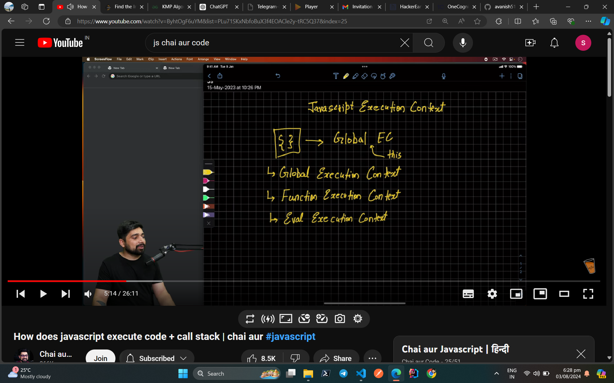

In JavaScript, an execution context is like a mental workspace where your code runs. Here’s a simple way to understand it:

What It Is: An execution context is a container that holds information about the environment in which the current code is being executed. It includes details like variable values, function definitions, and the scope chain.

Types of Execution Contexts:

Global Execution Context: This is the default context where your JavaScript code starts running. It includes all the global variables and functions.

for browser: this-> object (windows)

